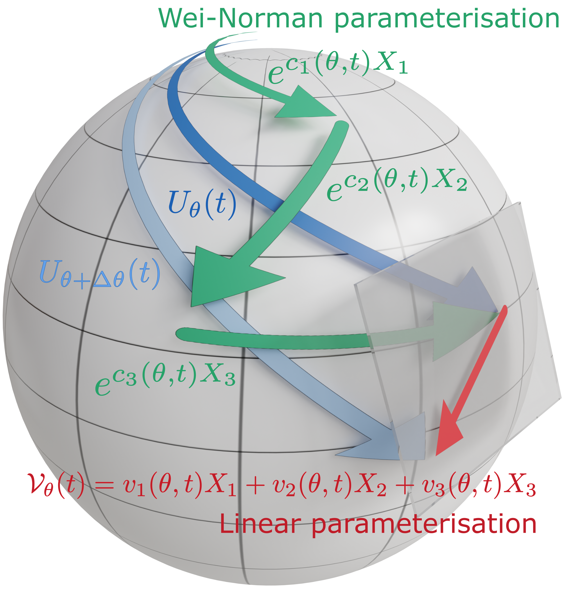

# Quantum metrology with linear Lie algebra parameterisations

[Ruvi Lecamwasam](mailto:me@ruvi.blog), [Tatiana Iakovleva](mailto:Tatiana.Iakovleva@oist.jp), & [Jason Twamley](mailto:jason.twamley@oist.jp)

Lecamwasam, R, Iakovleva, T, & Twamley, J (2024). Quantum metrology with linear Lie algebra parameterizations *Phys. Rev. Res.*, 6, 043137 [arXiv:2311.12446](https://arxiv.org/abs/2311.12446).

